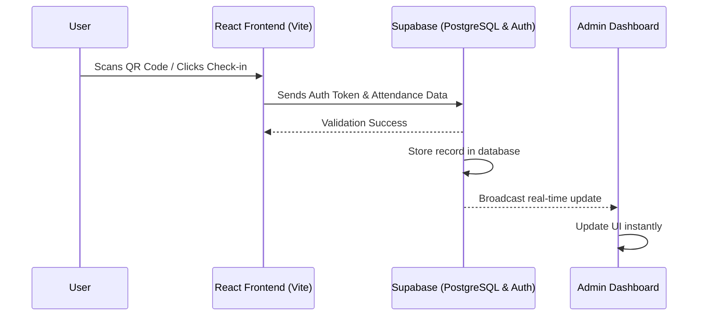

# ScanShift Attendance System 📱✨


A modern, fast, and secure QR-code based attendance tracking web application built for ScanShift Attendance System. 

---

## 🎯 The Problem

Traditional attendance tracking systems often rely on manual entry, paper logs, or outdated spreadsheet sharing. These methods are:
- **Time-Consuming:** Causes bottlenecks at entry points during peak hours.
- **Error-Prone & Inaccurate:** Highly susceptible to human error, missed logs, or buddy punching.
- **Lacking Real-Time Data:** Management cannot see who is currently present without manually tallying records.
- **High Maintenance:** Difficult to organize, backup, and export for payroll processing.

## 💡 The Solution

**ScanShift** solves this by providing a seamless, digital-first approach to attendance tracking using QR codes and real-time cloud synchronization.
- **Instant Check-in/Check-out:** Users can log their attendance in seconds by scanning a dynamic QR code.
- **Real-Time Dashboard:** Powered by **Supabase**, administrators can view attendance logs as they happen.
- **Secure & Reliable:** Authentication and database storage ensure that attendance records are immutable and accurate.
- **Beautiful & Intuitive UI:** Smooth animations with **Framer Motion** and a responsive interface make the app a joy to use on any device.

---

## 🚀 Features

- **QR Code Generation & Scanning:** Dynamic QR codes for secure, location-based attendance marking.
- **Real-Time Sync:** Instant updates across all connected clients using Supabase real-time subscriptions.
- **Secure Authentication:** Role-based access control ensuring data privacy.
- **Smooth Animations:** Fluid transitions and modal interactions using Framer Motion.
- **Modern Tech Stack:** Blazing fast development and production builds thanks to Vite and React.

---

## 🏗️ Architecture & Workflow



---

## 🛠️ Tech Stack

- **Frontend Framework:** React 18
- **Build Tool:** Vite
- **Backend & Database:** Supabase (PostgreSQL, Auth, Realtime)
- **Routing:** React Router v6
- **Animations:** Framer Motion
- **Date Formatting:** date-fns
- **QR Code Integration:** qrcode.react

---

## ⚙️ Local Development Setup

Follow these steps to run the project locally on your machine.

### Prerequisites
- [Node.js](https://nodejs.org/en/) (v16 or higher)
- [npm](https://www.npmjs.com/) or [yarn](https://yarnpkg.com/)
- A [Supabase](https://supabase.com/) account and project.

### 1. Clone the repository
```bash
git clone https://github.com/your-username/mzrmedia-attendance.git
cd mzrmedia-attendance
```

### 2. Install dependencies
```bash
npm install
```

### 3. Environment Variables
Create a `.env` file in the root directory and add your Supabase credentials:
```env
VITE_SUPABASE_URL=your_supabase_project_url
VITE_SUPABASE_ANON_KEY=your_supabase_anon_key
```

### 4. Start the Development Server
```bash
npm run dev
```
The application will be available at `http://localhost:5173`.

---

## 📁 Project Structure

```text
├── src/
│   ├── components/      # Reusable UI components (e.g., QRModal)
│   ├── pages/           # Route components (e.g., Login, Dashboard)
│   ├── App.jsx          # Main application component and routing
│   └── main.jsx         # React application entry point
├── public/              # Static assets
├── index.html           # HTML template
├── package.json         # Project metadata and dependencies
└── vite.config.js       # Vite configuration
```

---

## 🤝 Contributing

Contributions, issues, and feature requests are welcome! 
Feel free to check the [issues page](https://github.com/your-username/mzrmedia-attendance/issues).

---

## 📝 License

This project is licensed under the MIT License - see the LICENSE file for details.

---

## 👨‍💻 Author

**Kasim Shah**

Connect with me:
- **Portfolio:** [kasim-portfolio-umber.vercel.app](https://kasim-portfolio-umber.vercel.app/)
- **LinkedIn:** [Kasim Shah](https://www.linkedin.com/in/kasim-shah-176175340/)
- **GitHub:** [@kasimshah19](https://github.com/kasimshah19)

---

&copy; 2026 ScanShift Attendance System — All rights reserved
