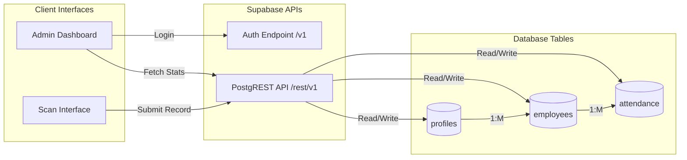

# API & Data Flow Diagram

This diagram visualizes how data flows between the user interfaces and the database tables.

## 📝 Detailed Explanation
- **PostgREST API:** Supabase automatically turns the PostgreSQL database into a REST API. We don't have to write backend Node.js or Python code.
- **Relational Integrity:** The `attendance` table relies entirely on the `employees` table. Without an employee ID, an attendance record cannot exist.
- **Decoupled Architecture:** The client UI only knows how to talk to the API. It has no direct database connection string, ensuring security and modularity.
