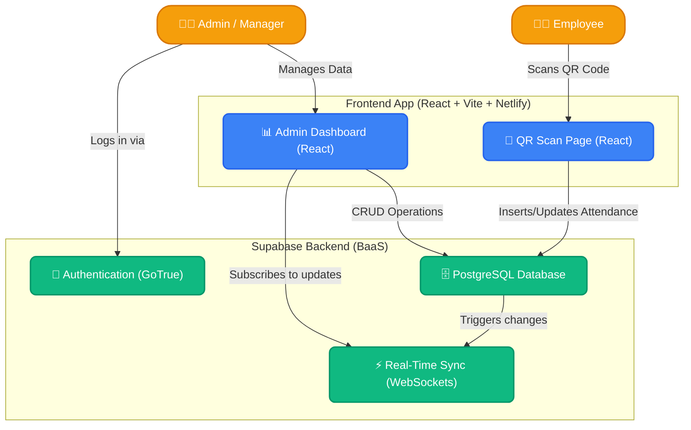

# System Architecture Diagram

This diagram represents the high-level architecture of the ScanShift Attendance System, showing how the frontend interacts with the Supabase backend and authentication.

## 📝 Detailed Explanation

### 1. Frontend Layer (React + Vite)
- **Admin Dashboard:** This is a protected route. Only authenticated Admins and Managers can access this. It communicates with the database to fetch employee lists, generate QR codes, and view real-time attendance logs.
- **QR Scan Page:** This is a public-facing page that does NOT require authentication. When an employee scans their unique QR code, it loads this page with their secure token to process their check-in/check-out.

### 2. Backend Layer (Supabase)
- **Authentication:** Handles Admin/Manager logins. Ensures that unauthorized people cannot access the dashboard or delete attendance records.
- **PostgreSQL Database:** The core of the system. It stores profiles, employees, and attendance records securely using Row Level Security (RLS). RLS guarantees that the public scan page can only insert attendance records but cannot view the full list of employees or delete records.
- **Real-Time Sync:** When an employee scans a QR code and inserts a record into the DB, Supabase sends a real-time WebSocket event. The Admin Dashboard listens to this and updates the screen instantly without needing a page refresh.
