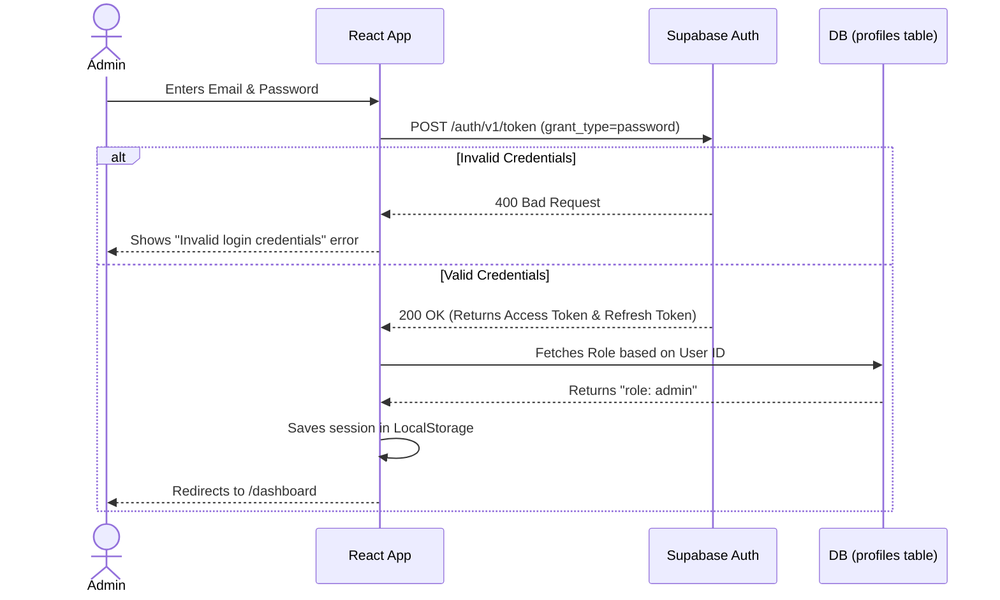

# Authentication Flow Diagram

This diagram explains how Admin login works using Supabase Auth (GoTrue).

## 📝 Detailed Explanation
1. **Email/Password Submission:** The admin types their credentials on the `/login` page.
2. **Supabase Auth API:** React sends this directly to the Supabase Authentication server.
3. **Session Management:** If successful, Supabase returns an Access Token (JWT) which the browser automatically saves. This token is attached to every future database request to prove the user's identity.
4. **Role Check:** The frontend then queries the `profiles` table to get the user's name and role to display in the sidebar.
