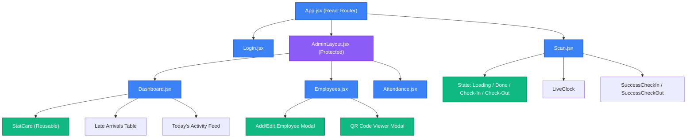

# Component Hierarchy Diagram

This diagram visualizes the React component structure for the ScanShift Attendance System.

## 📝 Detailed Explanation
- **Routing Level (`App.jsx`):** Handles all browser URLs. Unauthenticated users can only view `Login` or `Scan`.
- **Admin Layout (`AdminLayout.jsx`):** Acts as a wrapper. It checks if a valid Supabase session exists. If not, it kicks the user back to the login page. It also holds the Sidebar navigation.
- **Scan Page (`Scan.jsx`):** It is deeply dynamic and contains many smaller sub-components (like `LiveClock` and `SuccessCheckIn`) that render conditionally based on the scan's context.
