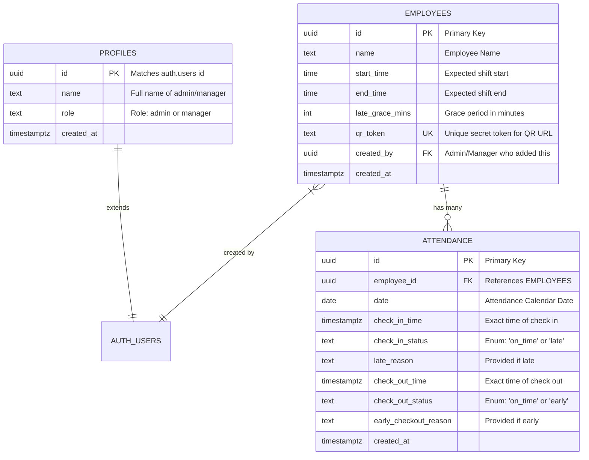

# Database Schema Diagram

This Entity-Relationship (ER) diagram visualizes the Supabase PostgreSQL database structure.

## 📝 Detailed Explanation

### 1. `profiles` Table
- **Purpose:** Enhances the built-in Supabase `auth.users` table. While `auth.users` handles secure passwords and emails, `profiles` stores the user's readable name and role (Admin vs Manager).
- **Security:** RLS ensures only logged-in users can read their own profile.

### 2. `employees` Table
- **Purpose:** Stores the core data of the staff members who will be scanning QR codes.
- **Key Columns:** 
  - `start_time` and `end_time` define the specific shift hours for the employee.
  - `late_grace_mins` provides a flexible buffer (e.g., 30 mins) before the system marks them as "Late".
  - `qr_token` is the highly sensitive unique identifier. It is mathematically random (UUID) so it cannot be guessed by outsiders.
- **Relationships:** It links to the `auth.users` table so we know which manager created the employee profile.

### 3. `attendance` Table
- **Purpose:** The transactional table that logs daily activity.
- **Constraints:**
  - A `UNIQUE` constraint on `(employee_id, date)` ensures that an employee can only have **one attendance record per day**.
  - A `CHECK` constraint guarantees that `check_out_time` cannot be earlier than `check_in_time`.
  - Conditional constraints ensure that if the status is marked as 'late', a `late_reason` **must** be provided.
- **Flexibility:** It separates the `date` (used for grouping and charting) from the precise `check_in_time` (used for calculating exactly how late someone was).
