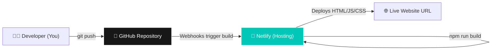

# Deployment & Hosting Architecture

This diagram shows how code moves from the developer's machine to the live website.

## 📝 Detailed Explanation
1. **Developer:** Writes React code locally and tests using `npm run dev`.
2. **GitHub:** When changes are ready, they are committed and pushed to the `main` branch on GitHub.
3. **Netlify (CI/CD):** Netlify is constantly watching the GitHub repository. The moment it sees a new commit on `main`, it automatically spins up a server, runs `npm run build`, and creates the production-ready static files.
4. **Live Website:** Within seconds, the new code is live on the internet. No manual server configuration is required.
