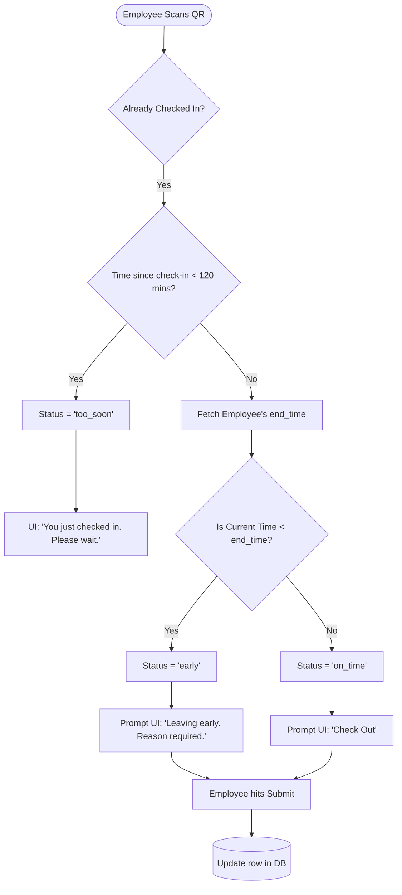

# Early Check-out Logic Flowchart

This flowchart explains the logic used in `Scan.jsx` to determine if an employee is leaving their shift early.

## 📝 Detailed Explanation
- **Anti-Spam Lock:** The `120 mins` check prevents employees from accidentally scanning twice in the morning and checking out immediately by mistake.
- **Early Detection:** If their `end_time` is 18:00 and they scan at 17:30, they are leaving early.
- **Mandatory Reason:** Just like late arrivals, early departures enforce accountability by forcing the employee to type a reason before the Check-Out button unlocks.
