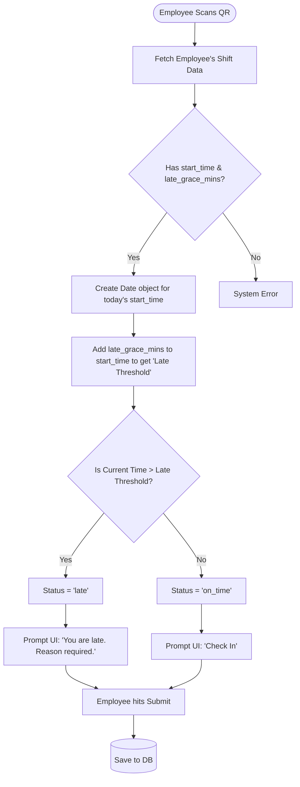

# Late Arrival Logic Flowchart

This flowchart explains the mathematical logic used in `Scan.jsx` to determine if an employee is late.

## 📝 Detailed Explanation
- **Custom Shifts:** Every employee can have a different `start_time` (e.g., 09:00 vs 10:00).
- **Grace Period:** `late_grace_mins` (e.g., 30 mins) gives employees a buffer.
- **The Math:** If a shift starts at 09:00 with a 30 min grace period, the `Late Threshold` is 09:30. If the employee scans at 09:31, they are late and must provide a text reason before the system allows them to check in.
