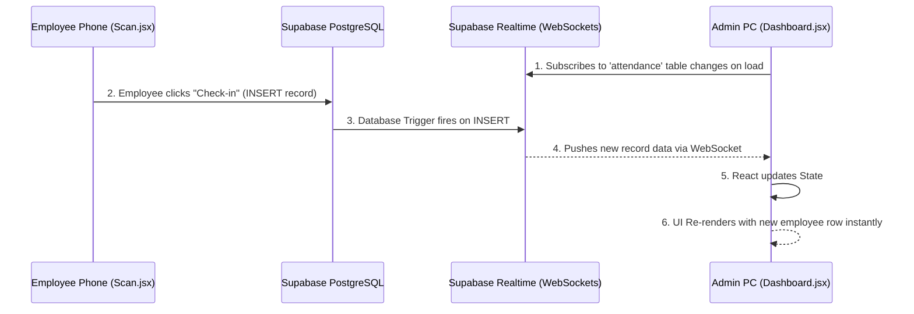

# Real-Time WebSocket Sync Diagram

This diagram explains how the admin dashboard updates instantly when an employee checks in, without the admin needing to refresh the page.

## 📝 Detailed Explanation
1. **Subscription:** When the Admin opens the dashboard, the React app uses the Supabase client to open a continuous WebSocket connection to the server, saying "tell me if anything changes in the `attendance` table".
2. **Action:** An employee far away scans their code and checks in.
3. **Database Event:** The PostgreSQL database successfully saves the row.
4. **Broadcast:** Supabase's built-in Realtime engine detects the database change and immediately broadcasts a JSON payload to all connected WebSocket clients (the admin dashboard).
5. **UI Update:** The React app receives the payload, adds the new record to its local array, and the screen updates instantly.
