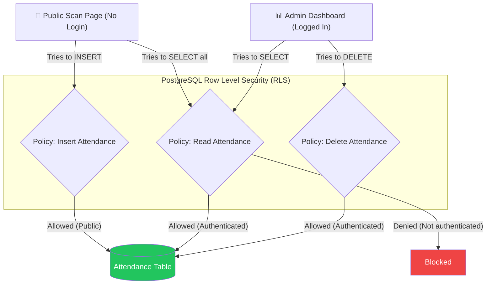

# Security & Row Level Security (RLS) Diagram

This diagram explains how Supabase secures data so that the public Scan Page can write data, but cannot read sensitive data or delete records.

## 📝 Detailed Explanation
- **Row Level Security (RLS)** is a feature of PostgreSQL that checks permissions on a row-by-row basis before executing a query.
- **The Public Problem:** Because the QR code is scanned on personal phones without login, the API key must be public. If a hacker got the API key, could they download all employee records?
- **The RLS Solution:** We wrote strict policies. The policy for inserting is public (so anyone with a valid QR token can insert a record). However, the policy for reading the whole table requires a valid JWT token from a logged-in admin. Therefore, the data is completely safe from public extraction.
