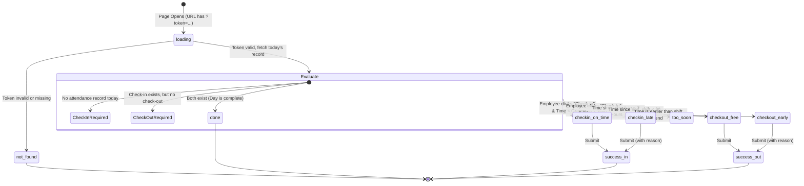

# Scan Page State Management Diagram

This diagram visualizes the complex state machine inside `Scan.jsx`. It determines what screen the employee sees after they scan their QR code.

## 📝 Detailed Explanation
- **`loading` state:** A loading spinner is shown while Supabase checks the `token`.
- **`Evaluate` step:** This is the core logic. It asks the database: "Has this person checked in today?".
- **Check-in Logic:** If they are late (past `start_time` + `grace_mins`), the state becomes `checkin_late` and forces them to provide a reason. Otherwise, it is `checkin_on_time`.
- **Check-out Logic:** 
    - `too_soon`: If they checked in less than 2 hours ago, check-out is locked to prevent accidental double-scans.
    - `checkout_early`: If they try to leave before their shift ends, they must provide a reason.
    - `checkout_free`: If they leave at the correct time, no reason is needed.
