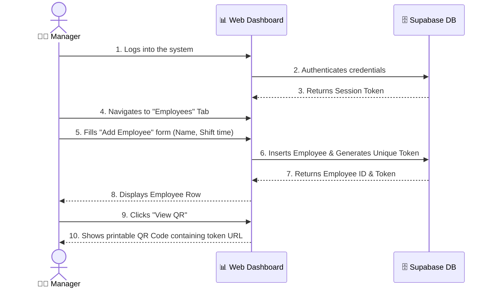
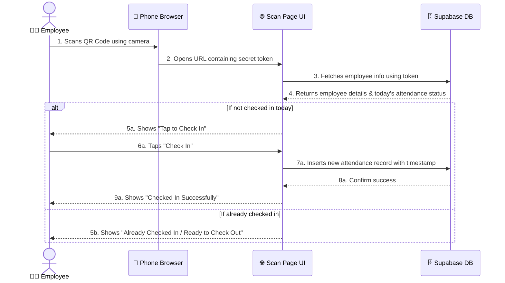

# User Flow Diagrams

These diagrams explain how different types of users interact with the ScanShift system.

## 1. Manager / Admin Flow

This diagram shows how a manager adds a new employee and gets the QR code.

### 📝 Detailed Explanation (Manager Flow)
1. **Login & Security:** The manager must authenticate. Without authentication, they cannot access the dashboard or insert an employee.
2. **Employee Creation:** When creating an employee, the dashboard automatically generates a completely unique UUID (Universal Unique Identifier) called `qr_token`.
3. **QR Generation:** The dashboard takes the `qr_token` and creates a URL (e.g., `scanshift.com/scan/1234-abcd`). It then turns this URL into a scannable QR image for the manager to print.

---

## 2. Employee Scan Flow (Check-In)

This diagram shows what happens when an employee scans the QR code.

### 📝 Detailed Explanation (Employee Flow)
1. **Frictionless Entry:** The employee doesn't type a URL or enter a password. Their native camera app decodes the URL and opens the browser automatically.
2. **Identity Verification:** The frontend extracts the `token` from the URL and securely asks the database, "Who does this token belong to?". The database returns the employee details.
3. **State Management:** The frontend checks the database to see if this person already has a record for *today*. 
    - If no record exists, it prompts for **Check-In**.
    - If a record exists but check-out is empty, it prompts for **Check-Out** (unless the 2-hour safety lock is active).
    - If both exist, it shows **Done for today**.
